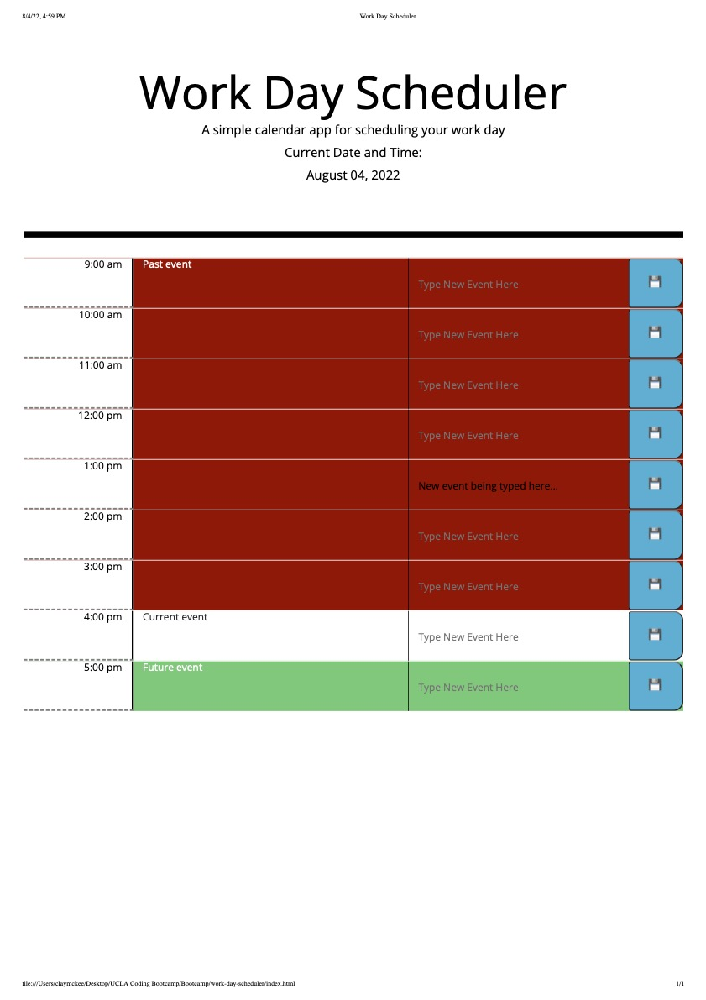

# Work Day Schedule

## Description

The Work Day Scheduler is set up so that someone can input events for specific times of the day. Upon entering the event, the input display clears and the input gets placed into the box beside the scheduled time of the event. The schedule turns red for hours that have passed, white for the current hour block, and green for future hour blocks. The current date is displayed at the top underneat the title, and it will automatically change based on the day with no input from the user. 

The HTML was designed using bootstrap, which allowed for a nice flexible design based on row/column divs. Javascript and JQuery allowed me to add functionality to the site, particularly for the events which are saved onto local storage and then populated into the events box based on the user input and a click of the "save" button. Moment.js allowed me to created the changing colors for the scheduler as hours pass, become present, or are still to come; it also supplies the current date in the jumbotron. CSS supplied the styling for the colors, borders, and button.

## Screenshot

